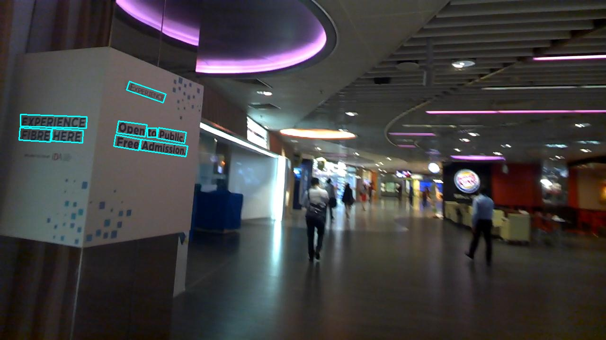

English | [中文](../../cn/inference/inference_tutorial.md)

## Inference - Tutorial

### 1. Introduction

MindOCR inference supports Ascend310/Ascend310P devices, supports [MindSpore Lite](https://www.mindspore.cn/lite) and
[ACL](https://www.hiascend.com/document/detail/zh/canncommercial/63RC1/inferapplicationdev/aclcppdevg/aclcppdevg_000004.html)
inference backend, integrates text detection, angle classification, and text recognition, implements end-to-end OCR
inference process, and optimizes inference performance using pipeline parallelism.

### 2. Environment

Please refer to the [environment installation](environment.md) to configure the inference runtime environment for
MindOCR, and pay attention to selecting the ACL/Lite environment based on the model.

### 3. Model conversion

MindOCR inference not only supports exported models from trained ckpt file, but also supports the third-party models, as
listed in the [MindOCR Models Support List](models_list.md) and
[Third-Party Models Support List](models_list_thirdparty.md).

Please refer to the [Conversion Tutorial](convert_tutorial.md), to convert it into a model format supported by
MindOCR inference.

### 4. Inference (Python)

Enter the inference directory：`cd deploy/py_infer`.

#### 4.1 Command example

- detection + classification + recognition

```shell
python infer.py \
    --input_images_dir=/path/to/images \
    --backend=lite \
    --det_model_path=/path/to/mindir/dbnet_resnet50.mindir \
    --det_model_name_or_config=../../configs/det/dbnet/db_r50_icdar15.yaml \
    --cls_model_path=/path/to/mindir/cls_mv3.mindir \
    --cls_model_name_or_config=ch_pp_mobile_cls_v2.0 \
    --rec_model_path=/path/to/mindir/crnn_resnet34.mindir \
    --rec_model_name_or_config=../../configs/rec/crnn/crnn_resnet34.yaml \
    --res_save_dir=det_cls_rec \
    --vis_pipeline_save_dir=det_cls_rec
```

The visualization images are stored in det_cls_rec, as shown in the picture.


The results are saved in det_cls_rec/pipeline_results.txt in the following format:

```
img_195.jpg	[{"transcription": "admission", "points": [[298.0, 295.0], [396.0, 309.0], [392.0, 331.0], [295.0, 317.0]]}, {"transcription": "free", "points": [[244.0, 285.0], [297.0, 295.0], [292.0, 318.0], [240.0, 309.0]]}, {"transcription": "here", "points": [[110.0, 272.0], [175.0, 276.0], [174.0, 302.0], [108.0, 298.0]]}, {"transcription": "fibre", "points": [[42.0, 270.0], [108.0, 274.0], [106.0, 300.0], [40.0, 296.0]]}, {"transcription": "public", "points": [[335.0, 270.0], [393.0, 280.0], [389.0, 303.0], [331.0, 292.0]]}, {"transcription": "to", "points": [[311.0, 271.0], [331.0, 271.0], [331.0, 290.0], [311.0, 290.0]]}, {"transcription": "open", "points": [[250.0, 256.0], [310.0, 264.0], [306.0, 289.0], [246.0, 281.0]]}, {"transcription": "experience", "points": [[43.0, 242.0], [183.0, 247.0], [182.0, 271.0], [43.0, 267.0]]}, {"transcription": "experience", "points": [[273.0, 172.0], [350.0, 199.0], [344.0, 217.0], [267.0, 190.0]]}]
```


- detection + recognition

If you don't enter the parameters related to classification, it will skip and only perform detection+recognition.

```shell
python infer.py \
    --input_images_dir=/path/to/images \
    --backend=lite \
    --det_model_path=/path/to/mindir/dbnet_resnet50.mindir \
    --det_model_name_or_config=../../configs/det/dbnet/db_r50_icdar15.yaml \
    --rec_model_path=/path/to/mindir/crnn_resnet34.mindir \
    --rec_model_name_or_config=../../configs/rec/crnn/crnn_resnet34.yaml \
    --res_save_dir=det_rec \
    --vis_pipeline_save_dir=det_rec
```

The visualization images are stored in det_rec, as shown in the picture.


The recognition results are saved in det_rec/pipeline_results.txt in the following format:

```
img_195.jpg	[{"transcription": "admission", "points": [[298.0, 295.0], [396.0, 309.0], [392.0, 331.0], [295.0, 317.0]]}, {"transcription": "free", "points": [[244.0, 285.0], [297.0, 295.0], [292.0, 318.0], [240.0, 309.0]]}, {"transcription": "here", "points": [[110.0, 272.0], [175.0, 276.0], [174.0, 302.0], [108.0, 298.0]]}, {"transcription": "fibre", "points": [[42.0, 270.0], [108.0, 274.0], [106.0, 300.0], [40.0, 296.0]]}, {"transcription": "public", "points": [[335.0, 270.0], [393.0, 280.0], [389.0, 303.0], [331.0, 292.0]]}, {"transcription": "to", "points": [[311.0, 271.0], [331.0, 271.0], [331.0, 290.0], [311.0, 290.0]]}, {"transcription": "open", "points": [[250.0, 256.0], [310.0, 264.0], [306.0, 289.0], [246.0, 281.0]]}, {"transcription": "experience", "points": [[43.0, 242.0], [183.0, 247.0], [182.0, 271.0], [43.0, 267.0]]}, {"transcription": "experience", "points": [[273.0, 172.0], [350.0, 199.0], [344.0, 217.0], [267.0, 190.0]]}]
```

- detection

Run text detection alone.

```shell
python infer.py \
    --input_images_dir=/path/to/images \
    --backend=lite \
    --det_model_path=/path/to/mindir/dbnet_resnet50.mindir \
    --det_model_name_or_config=../../configs/det/dbnet/db_r50_icdar15.yaml \
    --res_save_dir=det \
    --vis_det_save_dir=det
```

The visualization results are stored in the det folder, as shown in the picture.



The detection results are saved in the det/det_results.txt file in the following format:

```
img_195.jpg	[[[298.0, 295.0], [396.0, 309.0], [392.0, 331.0], [295.0, 317.0]], [[244.0, 285.0], [297.0, 295.0], [292.0, 318.0], [240.0, 309.0]], [[110.0, 272.0], [175.0, 276.0], [174.0, 302.0], [108.0, 298.0]], [[42.0, 270.0], [108.0, 274.0], [106.0, 300.0], [40.0, 296.0]], [[335.0, 270.0], [393.0, 280.0], [389.0, 303.0], [331.0, 292.0]], [[311.0, 271.0], [331.0, 271.0], [331.0, 290.0], [311.0, 290.0]], [[250.0, 256.0], [310.0, 264.0], [306.0, 289.0], [246.0, 281.0]], [[43.0, 242.0], [183.0, 247.0], [182.0, 271.0], [43.0, 267.0]], [[273.0, 172.0], [350.0, 199.0], [344.0, 217.0], [267.0, 190.0]]]
```

- classification

Run text angle classification alone.

```shell
# cls_mv3.mindir is converted from ppocr
python infer.py \
    --input_images_dir=/path/to/images \
    --backend=lite \
    --cls_model_path=/path/to/mindir/cls_mv3.mindir \
    --cls_model_name_or_config=ch_pp_mobile_cls_v2.0 \
    --res_save_dir=cls
```

The results will be saved in cls/cls_results.txt, with the following format:

```
word_867.png   ["180", 0.5176]
word_1679.png  ["180", 0.6226]
word_1189.png  ["0", 0.9360]
```

- recognition

Run text recognition alone.

```shell
python infer.py \
    --input_images_dir=/path/to/images \
    --backend=lite \
    --rec_model_path=/path/to/mindir/crnn_resnet34.mindir \
    --rec_model_name_or_config=../../configs/rec/crnn/crnn_resnet34.yaml \
    --res_save_dir=rec
```

The results will be saved in rec/rec_results.txt, with the following format:

```
word_421.png   "under"
word_1657.png  "candy"
word_1814.png  "cathay"
```

#### 4.2 Detail of inference parameter

- Basic settings


| name             | type | default | description                                              |
|:-----------------|:-----|:--------|:---------------------------------------------------------|
| input_images_dir | str  | None    | Image or folder path for inference                       |
| device           | str  | Ascend  | Device type, support Ascend                              |
| device_id        | int  | 0       | Device id                                                |
| backend          | str  | lite    | Inference backend, support acl, lite                     |
| parallel_num     | int  | 1       | Number of parallel in each stage of pipeline parallelism |
| precision_mode   | str  | None    | Precision mode, only supports setting by [Model Conversion](convert_tutorial.md) currently, and it takes no effect here |

- Saving Result

| name                  | type | default           | description                                            |
|:----------------------|:-----|:------------------|:-------------------------------------------------------|
| res_save_dir          | str  | inference_results | Saving dir for inference results                       |
| vis_det_save_dir      | str  | None              | Saving dir for images of with detection boxes          |
| vis_pipeline_save_dir | str  | None              | Saving dir for images of with detection boxes and text |
| vis_font_path         | str  | None              | Font path for drawing text                             |
| crop_save_dir         | str  | None              | Saving path for cropped images after detection         |
| show_log              | bool | False             | Whether show log when inferring                        |
| save_log_dir          | str  | None              | Log saving dir                                         |

- Text detection

| name                     | type | default | description                                            |
|:-------------------------|:-----|:--------|:-------------------------------------------------------|
| det_model_path           | str  | None    | Model path for text detection                          |
| det_model_name_or_config | str  | None    | Model name or YAML config file path for text detection |

- Text angle classification

| name                     | type | default | description                                                       |
|:-------------------------|:-----|:--------|:------------------------------------------------------------------|
| cls_model_path           | str  | None    | Model path for text angle classification                          |
| cls_model_name_or_config | str  | None    | Model name or YAML config file path for text angle classification |

- Text recognition

| name                     | type | default | description                                                                 |
|:-------------------------|:-----|:--------|:----------------------------------------------------------------------------|
| rec_model_path           | str  | None    | Model path for text recognition                                             |
| rec_model_name_or_config | str  | None    | Model name or YAML config file path for text recognition                    |
| character_dict_path      | str  | None    | Dict file for text recognition，default only supports numbers and lowercase |

Notes：

`*_model_name_or_config` can be the model name or YAML config file path, please refer to
[MindOCR Models Support List](models_list.md) and
[Third-Party Models Support List](models_list_thirdparty.md).

### 5. Inference (C++)

Currently, only the Chinese DBNet, CRNN, and SVTR models in the PP-OCR series are supported.

Enter the inference directory：`cd deploy/cpp_infer`,then execute the compilation script 'bash build.sh'. Once the build
process is complete, an executable file named 'infer' will be generated in the 'dist' directory located in the current
path.

#### 4.1 Command example

- detection + classification + recognition

```shell
./dist/infer \
    --input_images_dir /path/to/images \
    --backend lite \
    --det_model_path /path/to/mindir/dbnet_resnet50.mindir \
    --cls_model_path /path/to/mindir/crnn \
    --rec_model_path /path/to/mindir/crnn_resnet34.mindir \
    --character_dict_path /path/to/ppocr_keys_v1.txt \
    --res_save_dir det_cls_rec
```

The results will be saved in det_cls_rec/pipeline_results.txt, with the following format:

```
img_478.jpg	[{"transcription": "spa", "points": [[1114, 35], [1200, 0], [1234, 52], [1148, 97]]}, {...}]
```

- detection + recognition

If you don't enter the parameters related to classification, it will skip and only perform detection+recognition.

```shell
./dist/infer \
    --input_images_dir /path/to/images \
    --backend lite \
    --det_model_path /path/to/mindir/dbnet_resnet50.mindir \
    --rec_model_path /path/to/mindir/crnn_resnet34.mindir \
    --character_dict_path /path/to/ppocr_keys_v1.txt \
    --res_save_dir det_rec
```

The results will be saved in det_rec/pipeline_results.txt, with the following format:

```
img_478.jpg	[{"transcription": "spa", "points": [[1114, 35], [1200, 0], [1234, 52], [1148, 97]]}, {...}]
```

- detection

Run text detection alone.

```shell
./dist/infer \
    --input_images_dir /path/to/images \
    --backend lite \
    --det_model_path /path/to/mindir/dbnet_resnet50.mindir \
    --res_save_dir det
```

The results will be saved in det/det_results.txt, with the following format:

```
img_478.jpg    [[[1114, 35], [1200, 0], [1234, 52], [1148, 97]], [...]]]
```

- classification

Run text angle classification alone.

```shell
./dist/infer \
    --input_images_dir /path/to/images \
    --backend lite \
    --cls_model_path /path/to/mindir/crnn \
    --res_save_dir cls
```

The results will be saved in cls/cls_results.txt, with the following format:

```
word_867.png   ["180", 0.5176]
word_1679.png  ["180", 0.6226]
word_1189.png  ["0", 0.9360]
```

#### 4.2 Detail of inference parameter

- Basic settings


| name             | type | default | description                                              |
|:-----------------|:-----|:--------|:---------------------------------------------------------|
| input_images_dir | str  | None    | Image or folder path for inference                       |
| device           | str  | Ascend  | Device type, support Ascend                              |
| device_id        | int  | 0       | Device id                                                |
| backend          | str  | acl     | Inference backend, support acl, lite                     |
| parallel_num     | int  | 1       | Number of parallel in each stage of pipeline parallelism |

- Saving Result

| name         | type | default           | description                      |
|:-------------|:-----|:------------------|:---------------------------------|
| res_save_dir | str  | inference_results | Saving dir for inference results |

- Text detection

| name           | type | default | description                   |
|:---------------|:-----|:--------|:------------------------------|
| det_model_path | str  | None    | Model path for text detection |

- Text angle classification

| name           | type | default | description                              |
|:---------------|:-----|:--------|:-----------------------------------------|
| cls_model_path | str  | None    | Model path for text angle classification |

- Text recognition

| name                | type | default | description                                                                 |
|:--------------------|:-----|:--------|:----------------------------------------------------------------------------|
| rec_model_path      | str  | None    | Model path for text recognition                                             |
| rec_config_path     | str  | None    | Config file for text recognition                                            |
| character_dict_path | str  | None    | Dict file for text recognition，default only supports numbers and lowercase |
